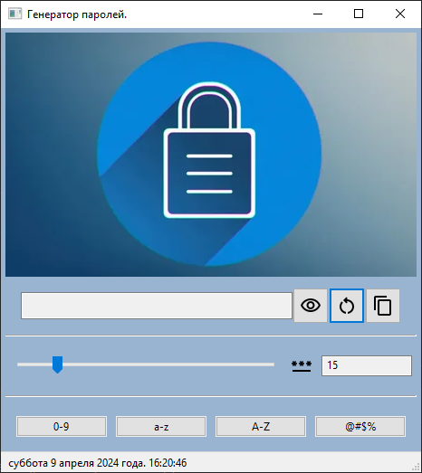

<h1 align="center">Password Generator</h1>

## Description / Описание

 Генератор паролей реализован на языке Python с использованием билиотеки wxPayton. 
 
 
## How to play / Использование

- Задайте количество символов пароля.
- Выберите наборы символов, которые должны быть в пароле.
- Создайте свой пароль. Скопировать его можно, нажав на кнопку копирования в окне.

### Оформление

Оопмление стандарное.